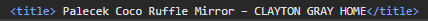

# Furniture Store Extraction Application

A tool for extracting, displaying, and exporting furniture
product data from any website, built using Django and React. It’s powered 
by a fine-tuned RoBERTa model for Named Entity Recognition (NER), 
with an automated pipeline for data collection and annotation.

# Table of Contents

<details open>
  <summary><strong>Click to expand or collapse</strong></summary>

  1. [Presentation of Functionality and Features](#1-presentation-of-functionality-and-features)
      - 1.1. [Full demonstration for one link and its subpages](#11-full-demonstration-for-one-link-and-its-subpages)
      - 1.2. [How to use](#12-how-to-use)
      - 1.3. [Real-time scraping and inference updates using WebSockets](#13-real-time-scraping-and-inference-updates-using-websockets)
      - 1.4. [Results Table](#14-results-table)
      
  2. [Motivation and Overview](#2-motivation-and-overview)
      - 2.1. [Task Overview](#21-task-overview)
      - 2.2. [My approach](#22-my-approach)

  3. [Installation and Setup](#3-installation-and-setup)
      - 3.1. [Prerequisites and Additional Downloads](#31-prerequisites-and-additional-downloads)
      - 3.2. [Frontend Setup (React)](#32-frontend-setup-react)
      - 3.3. [Backend Setup (Django)](#33-backend-setup-django)
      - 3.4. [Notebooks Setup](#34-notebooks-setup)

  4. [Model Development](#4-model-development)
       - 4.1. [Approach Overview and Initial Challenges](#41-approach-overview-and-initial-challenges)
       - 4.2. [Data Collection and Preprocessing](#42-data-collection-and-preprocessing)
           - 4.2.1. [Links Extraction](#421-links-extraction-1_links_for_trainingjpynb)
           - 4.2.2. [Raw Data Extraction](#422-raw-data-extraction-2_data_for_trainingjpynb)
           - 4.2.3. [Labeling and Filtering](#423-labeling-and-filtering-3_labeling_and_filteringjpynb)
      - 4.3. [Model Architecture](#43-model-architecture)
           - 4.3.1. [Transformer architecture](#431-transformer-architecture)
           - 4.3.2. [BERT and RoBERTa](#432-bert-and-roberta)
           - 4.3.3. [Observations and Takeaways](#433-observations-and-takeaways)
      - 4.4. [Training Process](#44-training-process)
      - 4.5. [Inference](#45-inference)

  5. [Backend: Django Server](#5-backend-django-server)
      - 5.1. [Scraping](#51-scraping)
      - 5.2. [Inference](#52-inference)
      - 5.3. [WebSocket Integration and Status Updates](#53-websocket-integration-and-status-updates)
      - 5.4. [API Endpoint](#54-api-endpoint)

  6. [Frontend: React Client](#6-frontend-react-client)
      - 6.1. [Libraries and Tools](#61-libraries-and-tools)
      - 6.2. [React Components and UI Design](#62-react-components-and-ui-design)
      - 6.3. [State Management and WebSocket Communication](#63-state-management-and-websocket-communication)

  7. [Possible Future Enhancements](#7-possible-future-enhancements)
      - 7.1. [Model Enhancements](#71-model-enhancements)
           - 7.1.1. [Hyperparameter Tuning](#711-hyperparameter-tuning)
           - 7.1.2. [Providing More and Cleaner Data](#712-providing-more-and-cleaner-data)
           - 7.1.3. [Adding a CRF Layer](#713-adding-a-crf-layer)
           - 7.1.4. [Model for Price and Image Extraction](#714-model-for-price-and-image-extraction)
      - 7.2. [App Improvements](#72-app-improvements)
  8. [Task Output (for the Internship)](#8-task-output-for-the-internship)
      
</details>


# 1. Presentation of Functionality and Features

## 1.1. Full demonstration for one link and its subpages


## 1.2. How to use
A short guide on how to use the application is also present in a dropdown menu of the user interface.
In short, you can:
- Paste a link to a furniture store page in the input field or upload a CSV file 
with multiple links present on the first column (note that
all the following options for extraction will apply to all the links in the CSV file).
- Choose if you want to search the subpages of the link for products as well.
- If you chose to search the subpages, you can also choose what paths the urls should contain (if what you search
for contains `/products/` in the URL for example).
- If you entered a sitemap (with the .xml extension), you can choose the XML tag to search for (loc is the most commonly used).
- After the scraping and inference are done, you can export the data as a CSV file with the click of a button.

Please note that the application is intended for desktop use only, and the UI is not optimized for other devices.
Also, the application as it stands is intended for running locally only, and not for deployment on a server.

## 1.3. Real-time scraping and inference updates using WebSockets
Over the course of the process, you can see progress updates in real time through WebSockets.

One thing to note here, is that for scraping pages with a lot of matching links, the progress bar
may not update that frequently (since it waits for the scraping of all the links from one recursion level before updating).

Do not refresh the page while the process is ongoing, as you will no longer get UI updates from the backend.
If you think the process is taking too long, you can always check the console to see the progress or 
to kill the backend if needed (assuming you are running the application locally).


## 1.4. Results Table
After the scraping process is done, you will start to see the results from each link appear in the table.
You can also scroll through all the pages at the same time as new products are being computed and added to the table.

The table will contain the following columns:
- Images scraped from the page where the product was found (using a rule-based approach and not a model).
- The name of the product found on the page (extracted by the model).
- The price of the product found on the page (extracted using a rule-based approach).
- The link to the page where the product was found.

A known issue is that you cannot scroll through the images from a product in the table while inference is ongoing,
as the images are not stored in any database and the table is rendered each time a new product is found.
The images are actually displayed using the src attribute of an img tag, so they are not stored in memory either.
 


# 2. Motivation and Overview


## 2.1. Task Overview

This project was built as a solution to a technical challenge for an internship application. Below is an overview of the task:
### Task:
- Create a new model that is able to extract products from Furniture Stores.


- Inputs:
  - A list of URLs from furniture store sites. Most will have products on them, some won’t, some won’t even work at all.
  - The URLs are given inside a CSV file (present in my repo as `furniture stores pages.csv`).
- Outputs:
  - A list of product names extracted from every URL alongside other relevant information or insights.


- They also recommend using the Transformer architecture from the sparknlp library or the huggingface transformers library. 

## 2.2. My approach
Important to note is that I did not pick up this 
challenge as a competition or as a way to display my skills.
I took this as a learning opportunity in the world of Machine Learning and NLP. I went blind 
into this challenge, not knowing what difficulties to expect or what the outcome would be. Having
just finished my first year of university (at the time of writing), I am yet to study machine learning formally.
Regardless, I am passionate about the subject and I spent quite a decent amount of time learning about 
this field on my own.

I considered this the perfect task for me to learn how to build a model from scratch 
to solve a real-world problem (and not just some dummy task with a dataset ready for you) and also how 
to integrate it into a full-stack application.

All the difficulties and challenges I faced are documented in their respective sections in this README.
I do feel that covering them could provide a valuable perspective to someone who is just
starting their ML journey (or their software engineering journey in general) and encountered similar problems. 
There was a lot of trial and error,
and a lot of information that is either hard to come by online, or even non-existent.


# 3. Installation and Setup

## 3.1. Prerequisites and Additional Downloads
- The backend and notebooks were built using Python 3.12 (but should work with python 3.10+ as well).
- The frontend was built using Node.js v20.15.0 (but should work with any relatively recent version of Node.js).
- Any modern web browser (Chrome, Firefox, Edge, etc.).

After you have all of the above, you can clone the repository using the following command:
```bash
git clone https://github.com/Geutzzu/FurnitureStoresExtraction.git
```
The repository contains three main directories:
1. Client: contains the frontend code.
2. Server: contains the backend code (without the model since its too large).
3. ModelDevelopment: contains the notebooks used for model development (and some CSV files
that were small enough to be uploaded to GitHub).

   
## 3.2. Frontend Setup (React)
- To install the frontend dependencies using node when loading for the first time you have to:
  #### 1. Navigate to the client directory:
     ```bash
     cd client
     ```
  #### 2. Install the dependencies:
     ```bash
      npm install
     ```
- Then, whenever you want to start the development server, you can run this from the client directory:
     ```bash
     npm run dev
     ```
- If everything went well, you should see the following when running:


## 3.3. Backend Setup (Django)
- To install the backend dependencies using pip when loading for the first time you have to:
  #### 1. Navigate to the django app directory:
     ```bash
     cd server/mlbackend
     ```
  #### 2. Set up a virtual environment if you don't have one (exactly the same as in the notebooks setup):
     ```bash
     python -m venv .venv
     ```
  #### 3. Activate the virtual environment:
     - On Windows:
       ```bash
       .venv\Scripts\activate
       ```
     - On Linux/Mac:
       ```bash
       source .venv/bin/activate
       ```
    #### 4. Install the dependencies:
     ```bash
    pip install -r requirements.txt
     ``` 
- After this, you will have to create a directory called `Models` (if it does not exist) in the `FurnitureFinder` directory
  (where the django app is located).
- You can then download one of my trained models from the Google Drive link below, and add it to the `Models` directory:
  - [ROB_0.89F1_16B_100000DAT](https://drive.google.com/drive/folders/1kuXdzfuZpfyJGMZYohPATBuOGeN6lxTz?usp=sharing)
- For the model above, the app will work plug-and-play. If you want to use a different model, you will have to
change the model path in the `inference.py` file in the `Scripts` directory inside the django app.
    ```py
    # load the model and tokenizer
    model_name = model_checkpoint = "MlBackend/FurnitureFinder/Models/ROB_0.89F1_16B_100000DAT"
    ```


- Then, to start the server using daphne, you can do so by running the following command (from the same directory):
     ````bash
     daphne -p 8000 MlBackend.asgi:application 
     ````
- If everything went well, you should see the following when running:
  
- NOTE: The WebSocket connection will not work unless you refresh
the page after the server is started. If it is connected, you will see this:


## 3.4. Notebooks Setup
- The notebooks were also built using Python 3.12. You can create a virtual environment using the exact same steps
as above in the following directory:
  ```bash
  cd ModelDevelopment
  ```
- If you want all the dependencies (although you can just install them as you go through the notebooks),
you can install them using the following command from that same directory:
  ```bash
  pip install -r requirements.txt
  ```
- NOTE: I did experience some issues using the `requirements.txt` file in pycharm due to the kernel
not being able to find the dependencies (although when checking for them via the terminal they are there). 
This did not bother me personally much since pycharm allows you to install
dependencies directly from the IDE. If installing through the IDE does not work, pip installing them manually in
your project should work just fine.


# 4. Model Development

## 4.1. Approach Overview and Initial Challenges

There is one thing I want to state from the start. The most challenging part in this project
was gathering data and preparing it for training. There are zero online resources that teach you how to
get data and prepare it for training / fine-tuning a model for NER. The one and only approach you will find
is to manually annotate the data. Now, the problem with this is that I totally refused to 
manually annotate data. It felt like low-level work that, for sure, could be automated. Even manually labeling
100 examples felt like a waste of time for me and for little result since 100 labeled examples are 
probably not enough for such a complex task.

Now, having said that, gathering data in an automated way that is coherent for a complex task like NER
is very difficult. Conceptually, building an algorithm that can provide
the dataset for your model would entail that you actually don't need the model in the first place.

One of my initial conclusions was that I needed to make the most out the data I had. I had a dataset
of 705 furniture store links given for this task (in the `furniture stores pages.csv` file). It would have
been a total waste not to search for products on all the pages of a given website. So this lead me into
a rabbit hole of learning about web scraping and how I can get the most product links effectively and efficiently
from any given website. 

The thought process was that if I have enough data, I can make a rule-based 
approach where I can get a chunk of it labeled correctly by looking at the HTML tags and 
common patterns in the website structure.

Below, I will go through what drove the decisions for my project notebook by notebook. I may not go into 
too much detail here
since the notebooks themselves contain their own share of comments and explanations. 

## 4.2. Data Collection and Preprocessing

Data collection and preprocessing were done in the 3 notebooks inside the `DataPreprocessingNotebooks` directory.

### 4.2.1. Links Extraction `1_links_for_training.jpynb`:
The goal with this notebook was to get as many links as possible that (most likely) contain products.
No content gathered from this step, just the links.

After trying a "brute force" approach that searched recursively for a tags in a page, I found out that
most websites (that respect themselves) have a sitemap. Sitemaps proved to be way more efficient to scrape
than recursively searching for a tags. The one problem with this was that not all the websites given had 
a sitemap. 

My script extracted 443 / 705 sitemaps from the given links, out of which not all were standard, easy to
scrape, sitemaps, but considering my needs, this was way more than enough and I found this soon enough.

An early-stopped run of my script gave me a dataset that contained ~278,000 links out of which a little over 300
unique domains (I forgot the exact value at the moment of writing) out of the 705 given. The script was early
stopped since it was taking too long, and that number of ~278,000 links was where the algorithm was plateauing
and not finding any new links.


The final CSV is called `dispersed_link_data.csv` and below is a Google Drive link to it:
- [dispersed_link_data.csv](https://drive.google.com/file/d/1PuN1kP2i6Jh1lIUMFqHaAr5AiubH356x/view?usp=sharing)


### 4.2.2. Raw Data Extraction `2_data_for_training.jpynb`:
This aims to get the raw data from all the links gathered in the previous step. 

This is also the right moment to explain the structure of the data that was fed to the model
and why it's designed like that.

The main thing I noticed about most furniture store websites is that:
- If they have a product name on the page, they will most likely have it in the h1 tag 
(I am referring to pages that feature one main product on them and not multiple ones like a category page).
- That exact same product name will most likely be in the url path at the end of the link.
- That exact same product name will also be located in the `<title>` tag of the page.

Here is an example taken from a random link from the initial CSV:




This holds true for most of the websites present in the dataset. Seeing that the information I am looking 
for (the product name) is present most of the time in these places, I have decided to scrape from each link just that:
URL last path, title and h1 tag. 

If I can get even just a handful of correctly annotated examples
that feature these 3 pieces of information, I may be able to train a model that can 
understand what a product name is.

Notice how I am using the sheer amount of data to "chery-pick" these good examples
that contain information in just the places I am looking for. I have the luxury to ignore
 websites that don't contain proper information (that contain bad words in the title for example). 

I can just keep the good data entries in a "greedy" type of way. 

A CSV that contains 100,000 entries made using the process described 
above can be downloaded from the following link:

- [preprocessed_data_from_all_sitemaps_100000.csv](https://drive.google.com/file/d/1M7PrWwwaTLH2GbFK7qVg8Ci2uZiK3Dba/view?usp=sharing)

This CSV is rather huge, and computing it took me a few hours (due to the overhead of scraping). That is why I stopped at 100000 entries
and even that is very large. The size also comes from the fact that I stored the entire text from the pages
(minus some tags that I removed).

### 4.2.3. Labeling and Filtering `3_labeling_and_filtering.jpynb`:
This is the final data preprocessing notebook. It filters and annotates the raw data from the CSV
created in the previous step. 

#### 1. Filtering for bad data entries:
- I check if the title (h1 tag content in this context and not the actual title html tag) contains any words that are likely to indicate that the title is not furniture
related (I did also include some plural forms of wanted words, so I don't get pages with multiple products like
a collections page etc.). Worth noting is that I can afford to lose data here so I can get as many
correctly annotated examples as possible. Also worth noting is that anyone can add or remove
words from this list to better suit the needs of their own dataset.

    ```py
    BAD_TEXT_PATTERNS_IN_TITLE = ['sale', 'releases', 'products', 'product', 'collections', 'collection', 'item', 'personalization', 'personalize', 'personalized', 'customize', 'customized', 'customise', 'customised', 'shop', 'store', 'stores', 'home', 'page', 'pages', 'about', 'contact', 'contact us', 'contact me', 'contact info', 'furniture', 'sofas', 'chairs', 'armchairs', 'furniture', 'gift', 'card', 'search' ] #  all generic names that would indicate that the h1 tag does not contain a product - we can afford to lose a few products in the dataset
    ```
- I check for my title to be of length 3 or more since correct product names that have two or fewer
words are rare and more often than not if a title has two or fewer words, it is not a product name.
    ```py
    # finally we remove anything that has a len < 2
    if len(row[1][0].split()) < 2:
        continue
    ```
Using this basic filtering, I reduced the number of unique domains from a little over 300 to
 286, which is still more than enough. Keep in mind that each domain in my context contains 
thousands if not tens of thousands of links with diverse furniture products. A better way to think
about the 286 unique domains is that there are 286 unique website structures for my model to learn from.
If there was any area where my dataset would lack diversity, it would be in this area, but with the dataset
provided, I think I did a good job at making the most out of it.

#### 2. Training entry format
Token entries will look like this:
    
Label entries will look like this:
    

Why this format you may ask? This is the format that made the most logical sense
to me in order to condense all the relevant information about the product names of a website
in one sequence. They are 
delimited in the way that they are such that the model can distinguish between
the sections. More details about this can be found in the notebook itself (such as
additional special tokens etc.).


#### 3. Annotating the data:
All my training data is annotated in the following way:
- I use the h1 tag as a reference for the product name (lowercased and with some text cleaning).
- I search for all the occurrences of that h1 tag in the main `[TEXT]` section (the body of the page)
and I annotate them using the `B-PRODUCT` tag for the beginning of the product name and the `I-PRODUCT` tag
for the rest of the product name (in accordance with the BIO tagging scheme).
- Optionally, I then search for all subsequences of max length that go over a certain fuzzy match threshold with the h1 tag
and label them in the same way as described in the last bullet point. I perform this only for
the `[TITLE]` section of the page and the `[URL]` section of the page.

You can tweak the fuzzy matching threshold and the number of 
tokens left and right of the h1 tag that you want to consider for annotation:
```py
tokens_left = 25
tokens_right = 40
similarity_threshold = 80
# consider the page_text, h1_tag_positions, title and url_last_path as given in this snippet"
tokens, labels = tokenize_and_label(page_text, h1_tag_positions, title, url_last_path, tokens_left=tokens_left, tokens_right=tokens_right, similarity_threshold=similarity_threshold)
```
These parameters can safely be changed to satisfy model needs, give more context etc. 
I have experimented
with a couple of values but not too many since training takes a considerable amount
of time on such a large dataset.

Here is a dataset that contains 84591 entries using the parameters written above:
- [100000_TL25_TR40_ST80.csv](https://drive.google.com/file/d/1I1F8IYhxIlLi4lkPdj1My9TyU2UbqB5h/view?usp=sharing)

This annotation method is not only more efficient for gathering data but also
very scalable, as anyone can come in and change some parameters, change the data,
and get even better results that I did. Also, the code is very modular, so anyone
can come and change how the scraping is done, how the filtering is done, how the annotation
is done etc. Although not perfect and difficult to get right, I would always choose such an approach over
manually annotating data.

## 4.3. Model Architecture

With the data ready for training, you are only left with choosing the right model architecture.
As suggested by the task, I looked into the transformer architecture and what models
it offers for NER / what other people have used. 

The "norm" for such tasks is to us e BERT model. There are many pre-trained
versions of BERT that you can fine-tune for NER (I have seen more than I can count).
What is important though is to understand how the arhitecture works and why it does so.
I will go through some important characteristics of BERT that I consider
relevant for understanding what works for the model and when it does. I will link the relevant
research papers for BERT and RoBERTa (the model I ended up getting the best results with) below.
- [BERT: Pre-training of Deep Bidirectional Transformers for Language Understanding](https://arxiv.org/abs/1810.04805)
- [RoBERTa: A Robustly Optimized BERT Pretraining Approach](https://arxiv.org/abs/1907.11692)

### 4.3.1. Transformer architecture


In short, the main difference between a GPT model and a BERT model is that BERT
can take in both the left and right context of a word at the same time. 

In the image above, T1, T2 ... Tn represent the tokens of a given sequence. The tokens
are all fed through multiple layers of self-attention and feed-forward neural networks
(the 2 combined are referred to as a transformer block or layer - Trm in the image). 

At a high level, the self-attention mechanism allows the model to understand the context
of each token by "looking at" other tokens in the sequence. 
This means each token can consider other tokens in the input at 
the same time. This helps the model build understand the relationship
between words in a sentence and pick up different meanings of the same word

So, with BERT (Bidirectional Encoder Representations from Transformers), 
it’s able to gather context from both the left and right of any given 
token in the sequence. This bidirectional approach allows BERT to 
understand the meaning of each token more fully before making 
predictions or classifications about it.

GPT models, on the other hand, don’t need this bidirectional 
context because they’re designed to predict the next word in a
sequence, so they only need the context from the tokens on the 
left of the current one. This left-to-right structure is more 
suited for language generation, which is what GPT models are built for.

E1, E2 ... En represent the embeddings of the tokens after they are passed
through the transformer layers. They can be then fed into a 
classification head to make predictions about the tokens (for example predict
the class of each token in a NER task which is exactly what I need).

### 4.3.2. BERT and RoBERTa

Both models use this bidirectional approach, the difference between them
being the way they are pre-trained. 

BERT is trained on the following two tasks:
- Masked Language Model (MLM): randomly mask some tokens in the input and
- Next Sentence Prediction (NSP): predict if the second sentence follows the first one.

RoBERTa is trained on an improved version of the MLM task where the masking is done
using dynamic masking (dynamically changing the masking pattern each epoch) instead
of static masking (the masking is done the same way for each training epoch but with some
data augmentation).

The interesting thing about RoBERTa is that it considered the NSP task to be irrelevant
for model performance and removed it for their training. 

On top of all of this, RoBERTa was trained using more data, for longer, and with slightly
modified hyperparameters.

### FUN FACT:
Here is an attempt of me drawing in paint how the model works for my data
(I apologize for my paint skills I really tried my best):


### 4.3.3. Observations and Takeaways:
- My token sequences do not really contain 
sentences since I joined the HTML tags via a space. This means that the NSP task
was probably irrelevant for my task if not even damaging to the model performance (since
all the dots in the sequences were coming from HTML tags and not from delimitation
of the tags). 
- Also, relevant is the complexity of my task. I consider the task of correctly labeling
product names from websites to be complex. Thus, I think it requires a model
that is as capable as possible.
- My best BERT model on the same parameters and dataset got a 0.81 F1 score while RoBERTa got a 
0.89 F1 score, which is a significant improvement.
- Another important aspect is matching the format of the pre-training data. If the training data
contained english sentences and punctuation, your fine-tuning data should contain the same.
Reading the paper to see what was used for training can give you a good idea of how you
can prepare your data for fine-tuning.


## 4.4. Training Process:

The training is done inside the `train_final.ipynb` notebook. The code is heavily based on 
the notebook found in the Huggingface transformers documentation:
- [NER Notebook](https://colab.research.google.com/github/huggingface/notebooks/blob/main/examples/token_classification.ipynb#scrollTo=YVx71GdAIrJH)

The code is pretty straightforward and easy to understand. It uses the `Trainer` API from transformers as well
as `AutoModelForTokenClassification` and `AutoTokenizer`. These provide a very easy and high level way to fine 
tune models and to test different models without changing the code.

Worth noting are the following:
- The train test split was done by grouping all data by their domain, and making the split based
on their domain. This ensures that the model is tested on different web structures and that the
results are not deceiving.
- Even with the previous point in mind, the F1 scores may still be a little misleading since all 
the data is gathered through heuristics and not manually annotated. 
- The final model was trained with a batch size of 16 for 2 epochs at a learning rate of 2e-5. Adding a larger batch size seemed
to only decrease performance and anything more than 2 epochs takes way too long to train.
- I did notice that the model could be under trained since the loss was still decreasing
at the end of the second epoch (but by a smaller amount). I did not have the time to experiment with
more epochs, and neither the resources to do so (Google Colab would shut down on me in the free version
and kaggle annoyed me with their strange way of downloading files).
- The model in the early stages tended to not catch the first token of a product name (`B-PRODUCT` tag) as well as leave
some gaps in the middle of the product name (`I-PRODUCT` tag). One simple measure I took to combat this
is by adjusting the loss function to value the `B-PRODUCT` tag more than the `I-PRODUCT` tag and the `O` tag.

    ```py
    class CustomTrainer(Trainer):
        def compute_loss(self, model, inputs, return_outputs=False):
            labels = inputs["labels"]  # keep labels in the input
            outputs = model(**inputs)
            logits = outputs.logits
    
            # move class weights to the same device as logits
            # the class weights are [0.1, 3.0, 1.0] for the O, B-PRODUCT, I-PRODUCT tags
            device = logits.device
            class_weights = torch.tensor([0.1, 3.0, 1.0], dtype=torch.float).to(device)
    
            # flatten logits and labels
            logits = logits.view(-1, len(label_map))  # (batch_size * sequence_length, num_labels)
            labels = labels.view(-1)  # (batch_size * sequence_length)
    
            # create the weighted loss function
            loss_fct = nn.CrossEntropyLoss(weight=class_weights, ignore_index=-100)
            loss = loss_fct(logits, labels)
    
            return (loss, outputs) if return_outputs else loss
    ```
- In the evaluation, all this adjustment did was change the ratio between precision and recall from being
around 1 to 1 (basically equal) to being more like 3 to 4 (in favor of recall). I consider this an
improvement since I would rather have a model that misses some product names than a model that 
incorrectly labels a lot of non-product names as product names. There are ways to actually fix this
issue that I will cover in a later section (Future Enhancements).

## 4.5. Inference

Model inference will be touched upon in the Django section of this README along with examples of how the model
performs on real-world data.

# 5. Backend: Django Server

This ML backend was built using Django and Django Channels for WebSocket communication. The backend
is responsible for handling model inference, scraping, and status updates.

## 5.1. Scraping
The scraping algorithm used in the backend is an adapted version of the one used for gathering the data.
The so called by me "brute force" approach is used for scraping the links of a website if it's not
a sitemap. The sitemap approach is used for sitemaps just like in the data collection phase.

The code is present both in the `app_scraping.jpynb` file (where I developed it) and in the `scraping.py` file
inside the `Scripts` directory of the Django app (which features the final version with async capabilities).

The code is pretty self-explanatory, but I will cover some of the thought process behind it:
- The script searches for all a tag links that contain the path specified by the user (if any).
- It recursively searches for links on each subpage it finds (with a limit of 2-3 recursion levels to avoid
performance issues) and marks them as "Checked" in a dictionary.
- This is done in a while loop (which basically simulates a DFS search) until there are no more links
that were not visited.
- The algorithm is designed to optimize in the event a sitemap is provided in the input.
- The algorithm also by default ignores pages that are likely to not lead to a product page.

### NOTES: 
- Although not perfect for finding every sub-link on a website, it can easily be
tweaked to suit the needs of the user. If the links are stored in JavaScript for example, the scraping
algorithm will fail to find them, but changes can be easily made to satisfy such needs of maximizing the
amount of links found. 
- The usage of simple libraries like `requests` and `beautifulsoup4` makes the code easy to understand
and accessible but at the cost of limited capabilities.
-  As it stands, it can handle very well most websites, and by giving it a collections
page, for example, it will successfully find the products on that page and not only.

## 5.2. Inference
The code and further explanations are present in the `app_inference.jpynb` file (where I developed it) and in the `inference.py` file
inside the `Scripts` directory of the Django app (which features the final version with async capabilities).

This part of the backend is responsible for:
- Making predictions on a given sequence.
- Find the price of the prediction it just found (by looking for the first appearance of a currency symbol)
- Find the images of the product (by looking at the images found before the token where the prediction was made)

There is one section I want to talk about specifically, and that is how I choose
the final product name to be displayed in my app. 

Obviously, the model returns a list of labels for each token in the sequence. The code responsible
for handling what the app displays is the following:
```py
def inference_on_link(link):
    word_tag_tuples, title, url_last_path, soup = link_content(link)
    if word_tag_tuples is None:
        return None, None, None, link

    input, word_tag_tuples = formated_link_content(word_tag_tuples, title,
                                                   url_last_path)  # this contains the [TEXT] tokens as tuples

    labels = predict_labels(input, model, tokenizer, label_list)

    # slicing in order to get the 3 parts of the input
    url_tokens, url_labels = input[1:input.index('[URL]')], labels[1:input.index('[URL]')]
    title_tokens, title_labels = input[input.index('[TITLE]') + 1:input.index('[TEXT]') - 1], labels[input.index('[TITLE]') + 1:input.index('[TEXT]') - 1]
    text_tokens, text_labels = input[input.index('[TEXT]') + 1: len(input) - 1], labels[input.index('[TEXT]') + 1: len(input) - 1]  

    url_start, url_end = find_product_indices(url_tokens, url_labels)
    title_start, title_end = find_product_indices(title_tokens, title_labels)
    text_start, text_end = find_product_indices(text_tokens, text_labels)

    if text_start is not None:
        product_tag = word_tag_tuples[text_start][1]  # the tag of the first token of the product name
        product_name = ' '.join([token for token in text_tokens[text_start:text_end + 1]])  # the product name
        product_price = find_currency_tag(product_tag)  # the tag of the first token of the price
        product_img = find_img_tag(product_tag)  # the tag of the first token of the image - actually a list of image sources
        product_price, product_img = product_price.get_text() if product_price else None, product_img if product_img else None  # the price and images
        return product_name, product_price, product_img, link  # return the product name, price, images and link
    elif title_start is not None:  # if the product name is in the title and not in the text, the result may actually be easier to find here, since there is less room for error
        product_name = ' '.join([token for token in title_tokens[title_start:title_end + 1]])
        return product_name, None, None, link
    elif url_start is not None:  # if the product name is in the url, same as with the title
        product_name = ' '.join([token for token in url_tokens[url_start:url_end + 1]])
        return product_name, None, None, link
    return None, None, None, link # return just the link if the product name is not found (in the frontend you don't want to display the link if there is no product name)
    # at least as I coded it, if you want to see what it missed, this can be changed
```

Notice how I first check for the product name in the `[TEXT]`. Even though this is the most correct
and fair way to do it, you could notice better results if you check for the product name in the `[TITLE]`
first since there is way less room for error there. The same goes for the `[URL]` section.

If you do that, you can then find the price and title by looking for the occurrences 
only if you also found the product name in the `[TEXT]` section.

An implementation that does just that is:
```py
# ... rest of the code
if text_start is not None:
    product_tag = word_tag_tuples[text_start][1]
    if title_start is not None: # the title is more likely to be the product name correctly
        product_name = ' '.join([token for token in title_tokens[title_start:title_end + 1]])
    elif url_start is not None: # the url is more likely to be the product name correctly than the text tokens
        product_name = ' '.join([token for token in url_tokens[url_start:url_end + 1]])
    else:
        product_name = ' '.join([token for token in text_tokens[text_start:text_end + 1]])
    product_price = find_currency_tag(product_tag)
    product_img = find_img_tag(product_tag)
    product_price, product_img = product_price.get_text() if product_price else None, product_img if product_img else None
    return product_name, product_price, product_img, link
elif title_start is not None:
    product_name = ' '.join([token for token in title_tokens[title_start:title_end + 1])
    return product_name, None, None, link
elif url_start is not None:
    product_name = ' '.join([token for token in url_tokens[url_start:url_end + 1])
    return product_name, None, None, link
return None, None, None, link

```

This way you get the `[TITLE]` and `[URL]` sections to help you find the product name 
and also get prices and images if the product name is found in the `[TEXT]` section.

### NOTES: 
- I did consider trying to find the price and images using a model, but the problem with that is that you
needed a model that could both find prices / images and then correlate them with the product name. I searched
some information about such models, they do exist, but seem very complex on their own and to implement
such capabilities to an already complex task and model would prove to be quite the challenge.
- The rule-based approach I used is not perfect, and honestly, it's mostly there to make the UI and 
user experience better, but it still provides the correct result most of the time.

### Demonstration of the inference process:
- Here is a link to a CSV created using the app after running it on an unseen website (I promise
I did not cheat here):
  - [products.csv](https://drive.google.com/file/d/1lR-sc3m2rjxphjUmZVTi-p2pxpEhLAf6/view?usp=sharing)
  
    

- The model does not always catch the product name correctly in the dataset above, but in this specific
case, it did not get the right result for product names that were in other languages (the url
contains the language, so filtering that out would have been simple through the app).
- There are instances sometimes when the model generally does not catch the product name correctly. This can be due to many
reasons such as insufficient training data (in some areas of furniture types), the model not being able to
catch the first token of a product name, the model not being able to catch the middle of a product name, etc.
- Once again, I will talk about potential solutions to these problems in the Future Enhancements section, 
but in my eyes, the model performs well enough for the task it was trained on.

## 5.3. WebSocket Integration and Status Updates

All the logic for the WebSocket communication is done via the `consumers.py` file.
It contains an extension of the `AsyncWebsocketConsumer` class that handles the connection, disconnection,
and message sending logic.

There is only one channel that any client can connect to and is not designed
to have multiple clients connected at the same time. 

One more detail to note is that all the methods need to be async since the WebSocket
communication is done asynchronously. You will also see the following line of code
used to yield control back to the event loop:
```py
await asyncio.sleep(0.1)
```
This is done because multithreading may not yield control back to the event loop.

In rest, the code is pretty straightforward and easy to understand. 

## 5.4. API Endpoint
The app features a single API endpoint used for establishing the WebSocket connection.

The relevant code is present in the `routing.py` file:

```py
from channels.routing import ProtocolTypeRouter, URLRouter
from django.core.asgi import get_asgi_application
from MlBackend.FurnitureFinder import consumers
from django.urls import path

# we have exactly one route for the websocket in our application
websocket_urlpatterns = [
    path('ws/inference/', consumers.InferenceConsumer.as_asgi()),
]

application = ProtocolTypeRouter({
    "http": get_asgi_application(),  # django’s ASGI application for HTTP requests
    "websocket": URLRouter(websocket_urlpatterns),  # routes WebSocket connections
})
```
This application is then sent to the `asgi.py` file:

```py

import os

os.environ.setdefault('DJANGO_SETTINGS_MODULE', 'MlBackend.settings')

from MlBackend.FurnitureFinder.routing import application

application = application
```
This is all I needed for my intended use case of the app. The rest
of the backend code is just standard Django structure and logic.


# 6. Frontend: React Client

## 6.1. Libraries and Tools

This app is built with the following libraries and tools:
- React for building the user interface.
- Vite for the development server and build tool.
- Tailwind CSS for styling the app.

## 6.2. React Components and UI Design

The app features 5 main compoenents:
- ProductApp.jsx - the main component that holds the state of the app, the rest of the components and the logic for the WebSocket connection.
- ProductTable.jsx - the component that renders the table with the results.
- InstructionsDropdown.jsx - the component that renders the instruction dropdown when pressed.
- UrlInput.jsx - the component that renders the input section of the app.
- Pagination.jsx - the component that provided the pagination for the table.

The design can be seen in the demonstration at the beginning of the README.

## 6.3. State Management and WebSocket Communication

The most relevant part of the frontend code is how I am handling the WebSocket communication.
```js
const socket = new WebSocket("ws://" + import.meta.env.VITE_ML_BACKEND_URL + "/ws/inference/");
    socketRef.current = socket; // store the reference in the ref

    socket.onopen = () => {
      console.log('WebSocket connection established.');
    };

    socket.onmessage = (event) => {
      const data = JSON.parse(event.data);

      if (data.message) { // if the message is a status message
        setStatusMessage(data.message); // set the status message
        console.log(data.message);
        if (data.message.startsWith("Iteration: ")) { // if the message is an iteration message
          console.log(data.message);
          const iterationIndex = parseInt(data.message.split(" ")[1]); // we update the current link index
          const link = data.message.split(" ")[2]; // we get the current link ( by convention the link is the second word in the message )
          currentLinkIndexRef.current = iterationIndex;
          setCurrentLink(link);
        }

        if (data.message.startsWith("Scraping: ")) { // if the message is a scraping status message
          setScrapingStatus(data.message);
        }

        if (data.message.startsWith("Inference: ")) { // if the message is an inference status message
          setInferenceStatus(data.message);
          console.log(totalNumLinksRef.current, currentLinkIndexRef.current);
          if (data.message === "Inference: Inference completed." && totalNumLinksRef.current <= currentLinkIndexRef.current) { // if the number of links is equal to the current link index 
            console.log('Inference completed.');
            setIsLoading(false);
          }
        }
      } else if (data.product_name && data.link) { // we got data to add to the results
        setResults((prevResults) => [
          ...prevResults, // keep the previous results
          {
            product_name: data.product_name, // add the product data to the results
            product_price: data.product_price, // add the product data to the results
            product_img_urls: data.product_img_urls, // add the product data to the results
            link: data.link, // add the product data to the results
          },
        ]);
      }
    };
```

This is the code snippet that handles just that. It creates a WebSocket connection to the backend
using the endpoint provided in the `.env` file. (which is left in the repository for demonstration purposes
since it points to a local server).

It then sets the status for each part of the process (scraping, inference, iteration) and updates the results
when the model sends them.

Then, all of these states are sent through props to the other components that need them and
use them to render the proper UI elements.

### NOTES:
- I did not really focus on the design of the app, but more on the functionality and model development.
- The design is simple and just enough to make the app usable and not an eyesore.
- The app is responsive, updates the states properly and does not have any bugs that I am aware of.
- All icons in my app are SVGs made using GPT-4o (he is actually good at this).
- The one image I use as a placeholder for the product images is a random image from the internet.

# 7. Possible Future Enhancements

## 7.1. Model Enhancements

### 7.1.1. Hyperparameter Tuning

The first and simplest way to improve the model performance is by tuning both
the CSV preprocessing parameters and the model hyperparameters. I did not have the time and
resources to try out that many different combinations in terms of batch size, learning rate, number of epochs,
fuzzy matching threshold, number of tokens left and right of the h1 tag, pre-trained models, etc.

My solution allows for easy tweaking and improvements in all areas of the model, from data gathering
to model training.

### 7.1.2. Providing More and Cleaner Data
Some improvements in my data gathering approach could be made to improve the model performance.
Examples of this are:
- Stricter filtering for bad data entries.
- More diversity in the website structures that the model is trained on.

NOTE: My model has been trained to only understand the structure of a product page
and not a collections page. It might struggle when such a layout is not provided. 
This is because this was the easiest way to get the most
data and the most correct data using my heuristic approach.


### 7.1.3. Adding a CRF Layer

Another possible enhancement has to do with the models tendency to neglect the correct
ordering of labels. After switching to RoBERTa though, this problem was less prevalent (in
the sense that I could not find isolated examples of this happening), so maybe just better
model performance is enough to fix this issue. 
Nevertheless, here are some examples that explain the problem better:
- Let's say the model predicts the following sequence (with not sub-tokens):
  - `O B-PRODUCT I-PRODUCT O O O O O I-PRODUCT I-PRODUCT I-PRODUCT`
- Such an output is not possible since the model should not predict an `I-PRODUCT` tag after an `O` tag.
- The probability for each tag indicates that the model is not sure about the position of
the first `B-PRODUCT` and some subsequent `I-PRODUCT` tags. The probabilities for such a token 
probably look something like this:
    - `O: 0.7, B-PRODUCT: 0.2, I-PRODUCT: 0.1`
- It still thinks that the token should be a `B-PRODUCT` tag, but it is not sure enough to make 
the prediction. 
- This is where a CRF layer can help. The exact probabilities that I just mentioned in my example
are fed to an additional CRF layer (Conditional Random Field) that will learn
the relationships between the tags and will make the prediction that makes the most sense.
- A brief explanation of how a CRF layer works on top of a BiLSTM model can be found 
[here](https://createmomo.github.io/2017/09/12/CRF_Layer_on_the_Top_of_BiLSTM_1/). Although
the example is for a BiLSTM model, the same principle can be applied to a transformer model
  (and I have seen people online suggesting this approach for transformer models).

An important final note is that I am quite positive that this problem can be fixed with
just better model performance gathered from hyperparameter tuning and more data. This is the 
trend that I noticed when jumping from DistilBERT to RoBERTa, so I do think it would continue since
transformers are way more powerful than BiLSTM models.

### 7.1.4. Model for Price and Image Extraction
One step further would be to train a model that can extract the price and images of a product
and correlate them with the product name. 

I heard some cool things about Multimodal Transformers and how they can be used for such tasks,
but this topic is just out of my reach at this moment.

## 7.2. App Improvements

The one and only improvement that I would make to the app is getting it ready for production.
One of the reasons I haven't done this is because I don't really know a platform that is free,
supports such scraping tasks and model usage. The second reason
is that the multithreading nature of the algorithm is not really suited for a production environment
as of this moment, and it would need quite a few changes to properly work (like being able
to kill the scraping process if it takes too long, etc.).


# 8. Task Output (for the Internship):

If you want to see the output for the task, well, you can just plug in the CSV and 
see what it outputs. I have done so myself, but the results are not impressive whatsoever.
Here are a couple of reasons as to why:

- Most links found in the CSV have been either taken down or are not working anymore (just the bare
link given and not the actual domain).
- The model is trained to understand the structure of a product page and not a collections page.
For all the collections pages provided in the dataset, it will not perform as well.
- Since the model itself is not perfect, it may catch some false positives such as Gift Card. The scraping
algorithm provided in the app is designed to ignore such pages, and thus complement this weakness,
but the model may fail from time to time to catch such cases.

Here is a link to what it outputs for me for all 705 links with no subpage scraping:
- [task_output.csv](https://drive.google.com/file/d/1D5fmaMPf2JTPGPC7V8A_WdOHUXUhkCZd/view?usp=sharing)

In my eyes, the task output is really not a good indicator of the app capabilities considering
my approach and the models strengths. Given a CSV of actual product pages that have not been taken down, 
the results would be much better (I promise). You could even give a few collection pages that you let
the app scrape and see how it performs on those. The scraping algorithm is there to help the model
on this exact limitation.